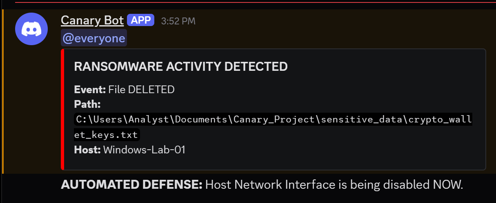

# Ransomware Canary: Automated Detection & Response System

## Project Overview
This project implements a Python-based Host Intrusion Detection System (HIDS) designed to detect ransomware encryption attempts in real-time. The system utilizes a "honeytoken" architecture to identify unauthorized file modifications and triggers an automated host isolation response to prevent lateral movement within a corporate network.

The core engineering objective was to minimize the "time-to-contain" metric by automating the network isolation process immediately upon detection of file integrity compromises.

## Key Features

* **Honeypot Generation:** Scripted generation of hidden, high-value target files (e.g., financial documents, password lists) to serve as bait for ransomware heuristics.
* **Real-time File Integrity Monitoring (FIM):** Utilizes the `watchdog` library to detect filesystem events with sub-second latency.
* **Automated SOAR Integration:** Dispatches high-severity alerts to a configured webhook (Discord/Slack) for immediate SOC visibility.
* **Host Isolation (Kill Switch):** Automatically executes system-level commands to disable the network interface, isolating the compromised host to prevent the spread of malware.

## Project Structure

* `ransomware_monitor.py`: The primary agent that monitors the directory and executes the response logic.
* `generate_canaries.py`: Utility script to create the hidden trap directory and populate it with bait files.
* `restore_network.py`: Recovery script to re-enable the network adapter after a successful isolation event.
* `requirements.txt`: List of necessary Python dependencies.

## Installation and Usage

### 1. Prerequisites
Ensure Python 3.x is installed. Clone the repository and install the required dependencies:

```bash
pip install -r requirements.txt

```

### 2. Configuration

Before running the monitor, ensure the webhook URL in `ransomware_monitor.py` is configured to your specific endpoint.

### 3. Deployment

**Step 1: Initialize the Trap**
Run the generator to create the hidden "sensitive_data" directory.

```bash
python generate_canaries.py

```

**Step 2: Start the Monitor**
Execute the monitoring agent. Note: Administrator privileges are required to execute the network isolation commands.

```bash
python ransomware_monitor.py

```

## Engineering Challenges

**Race Condition in Alert Delivery**
During the development of the response logic, a race condition was identified where the network isolation command executed faster (<10ms) than the HTTP alert request could complete. This resulted in the host being isolated before the alert was successfully transmitted to the SOC.

**Resolution:** The `isolate_host()` function was refactored to enforce synchronous execution order, prioritizing the API transmission of the alert payload immediately before the system call to disable the network adapter. This ensures 100% alert delivery reliability while maintaining a rapid isolation response time.

## Disclaimer

This tool is intended for educational purposes and defensive research in controlled environments. The "Kill Switch" functionality will actively disconnect the host from the network. Do not deploy in production environments without proper authorization and testing.

## 📸 Proof of Concept
**1. Terminal Output: Detection & Isolation**


**2. SOAR Alert: Discord Notification**
